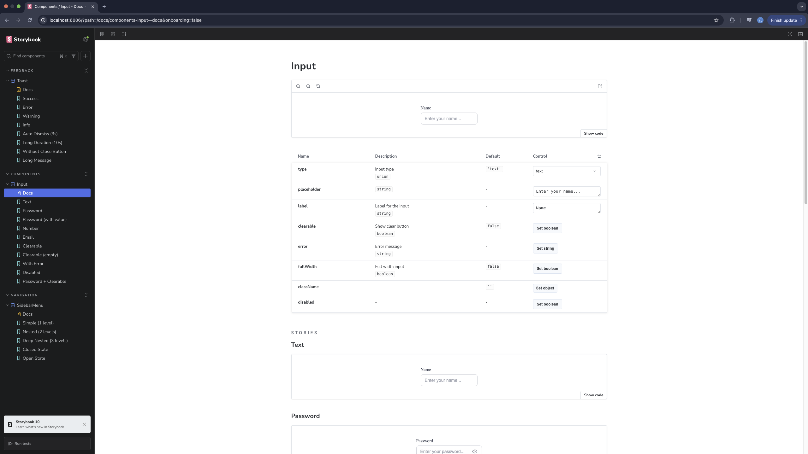
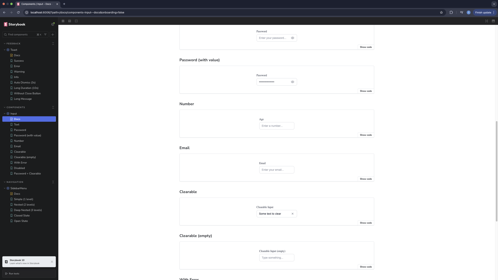
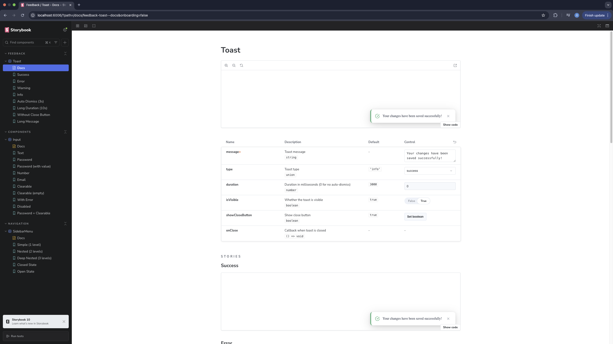
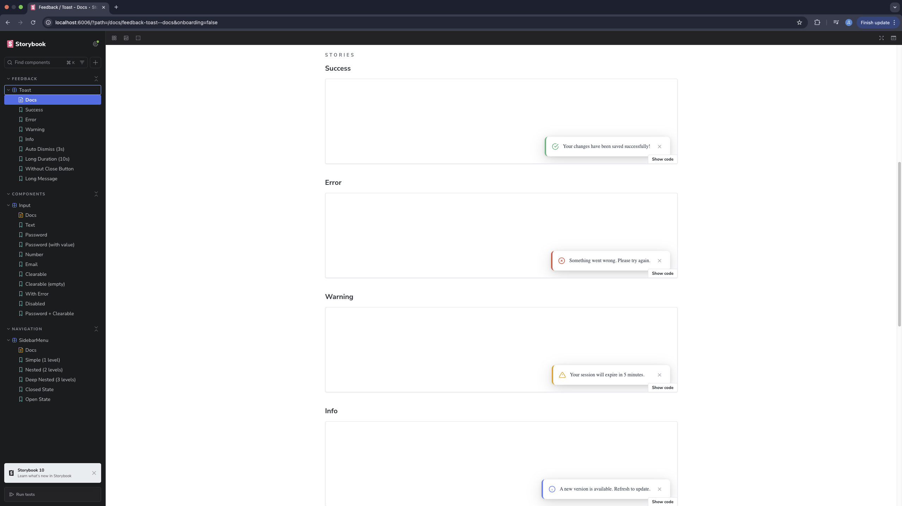
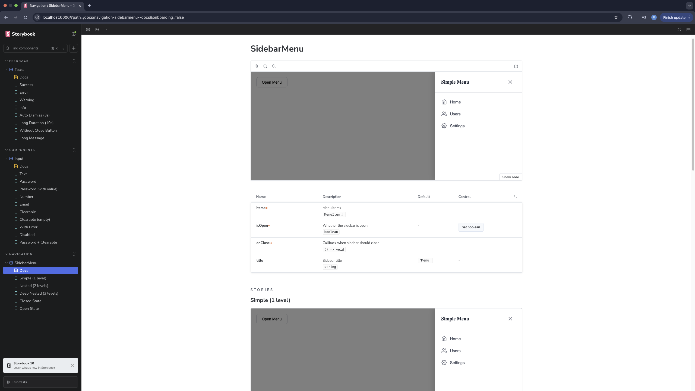
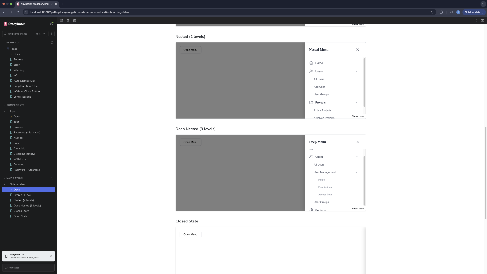

# React Component Library with Storybook

A React component library built with TypeScript, Vite, and Storybook. This library includes three reusable UI components: Input, Toast, and SidebarMenu.

## 🚀 Quick Start

### Prerequisites

- Node.js 18+
- npm or yarn

### Installation

```bash
# Clone the repository
git clone <your-repo-url>
cd storybook

# Install dependencies
npm install

# Start Storybook
npm run storybook
```

Storybook will open at [http://localhost:6006](http://localhost:6006)

### Available Scripts

| Command                   | Description                    |
| ------------------------- | ------------------------------ |
| `npm run dev`             | Start Vite development server  |
| `npm run storybook`       | Start Storybook on port 6006   |
| `npm run build`           | Build the project              |
| `npm run build-storybook` | Build Storybook for production |
| `npm run lint`            | Run ESLint                     |

---

## 📦 Components

### 1. Input Component

A smart, multi-type input component with password visibility toggle and clearable functionality.

#### Props

| Prop        | Type                                          | Default  | Description       |
| ----------- | --------------------------------------------- | -------- | ----------------- |
| `type`      | `'text' \| 'password' \| 'number' \| 'email'` | `'text'` | Input type        |
| `clearable` | `boolean`                                     | `false`  | Show clear button |
| `label`     | `string`                                      | -        | Label text        |
| `error`     | `string`                                      | -        | Error message     |
| `fullWidth` | `boolean`                                     | `false`  | Full width input  |

#### Features

- 👁️ Password visibility toggle (eye icon)
- ❌ Clearable input with X button
- ⚠️ Error state styling
- ♿ Accessible with proper ARIA labels

#### Usage

```tsx
import { Input } from './components/Input';

// Text input
<Input type="text" label="Name" placeholder="Enter your name" />

// Password with toggle
<Input type="password" label="Password" />

// Clearable input
<Input type="text" clearable label="Search" />
```

#### Screenshots

**Input:**




---

### 2. Toast Component

A notification toast component with multiple variants and auto-dismiss functionality.

#### Props

| Prop              | Type                                          | Default  | Description                          |
| ----------------- | --------------------------------------------- | -------- | ------------------------------------ |
| `message`         | `string`                                      | -        | Toast message                        |
| `type`            | `'success' \| 'error' \| 'warning' \| 'info'` | `'info'` | Toast variant                        |
| `duration`        | `number`                                      | `3000`   | Auto-dismiss duration (0 to disable) |
| `showCloseButton` | `boolean`                                     | `true`   | Show close button                    |
| `onClose`         | `() => void`                                  | -        | Close callback                       |
| `isVisible`       | `boolean`                                     | `true`   | Visibility control                   |

#### Features

- 🎨 Four variants: success, error, warning, info
- ⏱️ Auto-dismiss with configurable duration
- 🎬 Slide-in/out animations
- ❌ Optional close button

#### Usage

```tsx
import { Toast, ToastContainer } from './components/Toast';

<ToastContainer>
  <Toast message="Changes saved successfully!" type="success" duration={3000} />
</ToastContainer>;
```

#### Screenshots

**Toast:**




---

### 3. SidebarMenu Component

A sliding sidebar menu with support for nested/accordion submenus.

#### Props

| Prop      | Type         | Default  | Description        |
| --------- | ------------ | -------- | ------------------ |
| `items`   | `MenuItem[]` | -        | Menu items array   |
| `isOpen`  | `boolean`    | -        | Sidebar open state |
| `onClose` | `() => void` | -        | Close callback     |
| `title`   | `string`     | `'Menu'` | Sidebar title      |

#### MenuItem Interface

```typescript
interface MenuItem {
  id: string;
  label: string;
  icon?: React.ReactNode;
  href?: string;
  children?: MenuItem[];
  onClick?: () => void;
}
```

#### Features

- 🎬 Slide-in animation from right
- 📂 Nested submenus (accordion style)
- 🌑 Backdrop overlay with click-to-close
- 🎨 Support for icons

#### Usage

```tsx
import { SidebarMenu } from './components/SidebarMenu';

const menuItems = [
  { id: 'home', label: 'Home', icon: <HomeIcon /> },
  {
    id: 'settings',
    label: 'Settings',
    children: [
      { id: 'profile', label: 'Profile' },
      { id: 'security', label: 'Security' },
    ],
  },
];

<SidebarMenu items={menuItems} isOpen={isOpen} onClose={() => setIsOpen(false)} />;
```

#### Screenshots

**Sidebar Menu:**




---

## 📁 Project Structure

```
src/
├── components/
│   ├── Input/
│   │   ├── Input.tsx
│   │   ├── Input.css
│   │   └── index.ts
│   ├── Toast/
│   │   ├── Toast.tsx
│   │   ├── Toast.css
│   │   └── index.ts
│   ├── SidebarMenu/
│   │   ├── SidebarMenu.tsx
│   │   ├── SidebarMenu.css
│   │   └── index.ts
│   └── index.ts
├── stories/
│   ├── Input/
│   │   └── Input.stories.tsx
│   ├── Feedback/
│   │   └── Toast.stories.tsx
│   └── Navigation/
│       └── SidebarMenu.stories.tsx
└── ...
```

---

## 🛠️ Tech Stack

- **React 19** - UI library
- **TypeScript** - Type safety
- **Vite** - Build tool
- **Storybook 10** - Component documentation
- **ESLint** - Code linting
- **Prettier** - Code formatting

---
